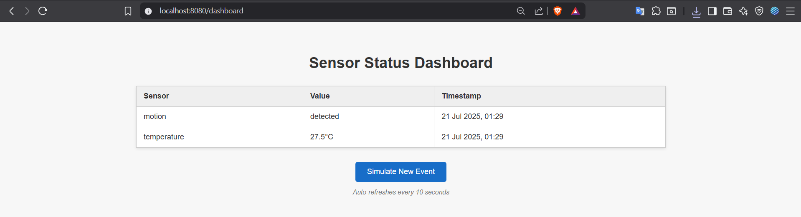
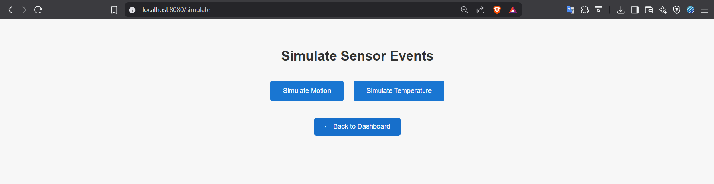

# Smart Home Event Notification System

A distributed system that simulates a smart home environment with event notifications using **RabbitMQ**, **Go**, **SQLite**, and **REST APIs**. Sensor data is processed in real-time and made available via APIs and a polished web dashboard.

---

## 📌 Features

- 🔌 Simulated sensors (motion, temperature)
- 🐇 RabbitMQ message queue for event delivery
- 🛠️ Backend service in Go
- 💾 SQLite database for event persistence
- 🌐 RESTful APIs for retrieving logs and status
- 🖥️ HTML dashboard and simulator with auto-refresh
- 🐳 Docker support (app + RabbitMQ)

---

## 🧱 Technologies Used

- **Go** (Golang 1.24.5)
- **RabbitMQ** (via Docker)
- **SQLite** (with `go-sqlite3`)
- **HTML Templates** (Go’s `html/template`)
- **Docker** and **Docker Compose**

---

## 🧠 Architecture

```
[Sensor Simulator Page]  → (POST /simulate)
         ↓
   [RabbitMQ Queue]
         ↓
[Go Consumer Service] → [SQLite DB]
         ↓
     [REST APIs + Web UI]
```

---

## 🚀 Getting Started

### 1. Clone the Repository

```bash
git clone https://github.com/askariabidi/smart-home-notifier.git
cd smart-home-notifier
```

---

### 2. Start with Docker

```bash
docker-compose up --build
```

This will:
- Start RabbitMQ (with UI on port 15672)
- Build and run your Go application (on port 8080)

---

## 🌐 Web Interface & API Endpoints

| Route             | Method | Description                                 |
|------------------|--------|---------------------------------------------|
| `/`              | GET    | Welcome message                             |
| `/dashboard`     | GET    | Dashboard UI showing sensor values          |
| `/simulate`      | GET/POST | Trigger simulated sensor events           |
| `/logs`          | GET    | JSON list of all events                     |
| `/status`        | GET    | JSON of latest value per sensor             |
| `http://localhost:15672` | - | RabbitMQ Web UI (guest / guest)         |

---

## 📦 Docker File Structure

- `Dockerfile` – builds the Go app
- `docker-compose.yml` – starts both app and RabbitMQ
- `.dockerignore` – avoids copying unnecessary files

---

## 📸 Screenshots

### 🖥️ Dashboard


### 🎛️ Simulate Event Page


---

## 👨‍💻 Author

**Syed Mohammad Askari Abidi**  
Master’s in Software Science and Technology  
University of Florence, 2024–2025  
GitHub: [@askariabidi](https://github.com/askariabidi)

---

## ⚖️ License

This project is licensed under the MIT License – see the `LICENSE` file for details.
